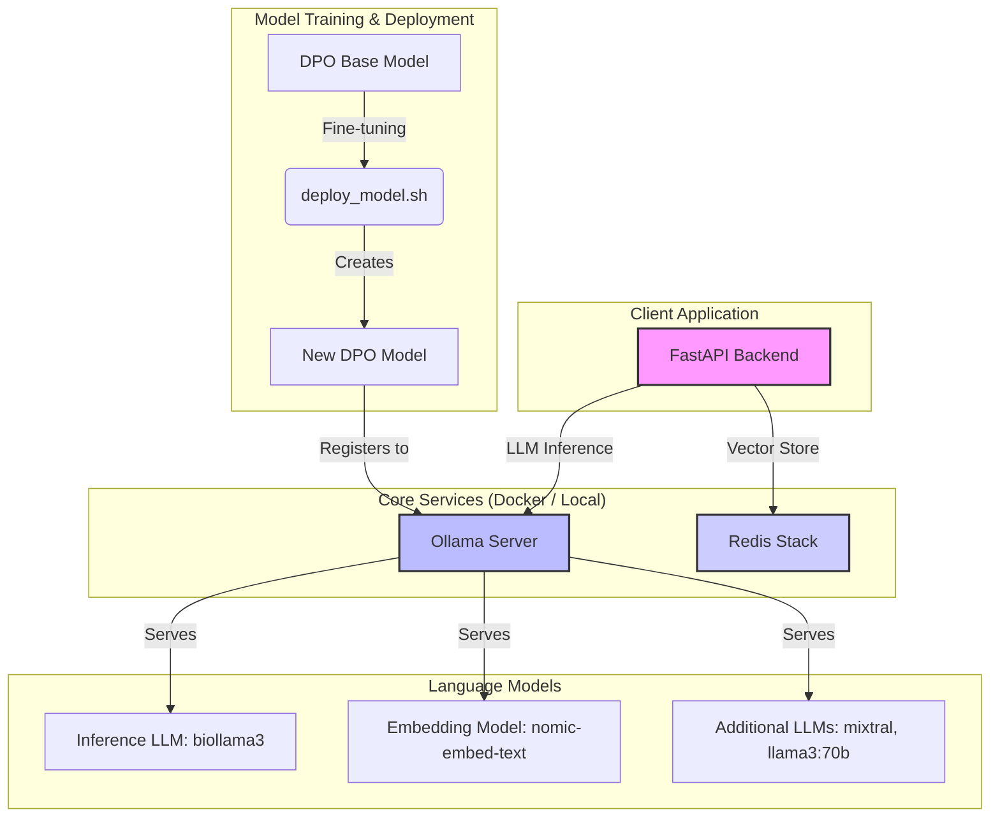

# Labnote LLM Server

## 📝 개요

**Labnote LLM Server**는 연구 및 개발 환경을 위한 강력한 LLM(거대 언어 모델) 백엔드 시스템입니다. Ollama를 통해 최신 오픈소스 LLM을 손쉽게 로컬에서 구동하고, Redis를 벡터 데이터베이스로 활용하여 RAG(Retrieval-Augmented Generation) 파이프라인을 구축할 수 있습니다.

또한, DPO(Direct Preference Optimization) 학습 파이프라인을 지원하여 특정 도메인에 맞는 모델을 직접 튜닝하고, 자동화된 스크립트를 통해 손쉽게 배포할 수 있는 환경을 제공합니다.

## 🚀 주요 특징

  * **로컬 LLM 구동**: `Ollama`를 사용하여 Llama3, Mixtral 등 다양한 최신 LLM을 로컬 환경에서 직접 실행합니다.
  * **고성능 벡터 DB**: `Redis Stack`을 벡터 데이터베이스로 활용하여 대규모 문서 임베딩 및 빠른 유사도 검색을 지원합니다.
  * **모델 튜닝 및 배포 자동화**: DPO 학습을 위한 환경이 구성되어 있으며, 학습된 모델을 GGUF 형식으로 변환하고 Ollama에 등록하는 과정을 `deploy_model.sh` 스크립트로 자동화합니다.
  * **간편한 환경 구축**: `setup.sh` 스크립트 하나로 시스템 의존성, 모델 다운로드, 환경 설정까지 한 번에 완료할 수 있습니다.
  * **컨테이너 기반 개발 환경**: `docker-compose.yml`을 통해 Ollama와 Redis를 포함한 전체 개발 환경을 컨테이너로 손쉽게 관리할 수 있습니다.
  * **유연한 모델 관리**: `biollama3`를 기본推론 모델로 사용하며, `mixtral`, `llama3:70b` 등 추가적인 모델을 손쉽게 다운로드하고 사용할 수 있습니다.

## 📊 시스템 아키텍처

아래 다이어그램은 Labnote LLM Server의 전체적인 구조와 구성 요소 간의 상호작용을 보여줍니다.



## 🏁 시작하기

### 사전 요구사항

  * Linux 기반 운영체제 (Ubuntu 권장)
  * NVIDIA GPU 및 NVIDIA Container Toolkit (GPU 가속을 사용하는 경우)
  * Python 3.8 이상
  * `curl`, `gpg` 등 기본적인 커맨드라인 도구

### 1\. 자동 설치 (`setup.sh` 사용)

가장 간편한 방법은 제공된 `setup.sh` 스크립트를 실행하는 것입니다. 이 스크립트는 다음 작업을 자동으로 수행합니다:

1.  시스템 패키지 업데이트 및 필수 도구 설치
2.  Redis Stack 서버 설치 및 실행
3.  Ollama 설치 및 `nomic-embed-text` 임베딩 모델 다운로드
4.  추론 및 DPO 학습을 위한 기본 LLM (`Llama3-OpenBioLLM-8B`) 다운로드
5.  Ollama에 추론 모델(`biollama3`) 등록
6.  `mixtral`, `llama3:70b` 등 추가 모델 다운로드
7.  `.env` 파일 생성 및 Python 의존성 설치 (`requirements.txt` 기반)

<!-- end list -->

```bash
chmod +x setup.sh
./setup.sh
```

### 2\. Docker를 이용한 설치 (`docker-compose.yml` 사용)

핵심 서비스인 Ollama와 Redis만 빠르게 실행하고 싶다면 Docker Compose를 사용할 수 있습니다. 이 방법은 로컬 시스템을 깔끔하게 유지하면서 개발 환경을 구성할 때 유용합니다.

1.  **Docker 및 Docker Compose 설치**: 시스템에 Docker와 Docker Compose가 설치되어 있는지 확인합니다.

2.  **`docker-compose.yml` 설정 확인**:

      * `ollama_data`, `redis_data` 볼륨을 통해 데이터가 영구적으로 저장됩니다.
      * GPU를 사용하려면 `docker-compose.yml` 파일 내의 `deploy` 섹션 주석을 해제하세요.

3.  **서비스 실행**:

    ```bash
    docker-compose up -d
    ```

      * **Ollama**: `http://localhost:11434` 에서 실행됩니다.
      * **Redis Insight**: `http://localhost:8001` 에서 데이터베이스 GUI에 접근할 수 있습니다.

## 🛠️ 사용법

### FastAPI 백엔드 서버 실행

`setup.sh`를 통해 모든 설정이 완료되었다면, 다음 명령어로 백엔드 서버를 시작할 수 있습니다.

```bash
cd labnote-ai-backend
uvicorn main:app --host 0.0.0.0 --port 8000
```

### DPO 학습 파이프라인 실행 (선택 사항)

모델을 직접 튜닝하고 싶다면 다음 스크립트를 실행하세요.

```bash
cd labnote-ai-backend
python scripts/run_dpo_training.py
```

## 📦 모델 관리

### DPO 학습 모델 배포

DPO 학습이 완료된 후, `deploy_model.sh` 스크립트를 사용하여 새로운 모델을 배포할 수 있습니다. 이 스크립트는 다음 과정을 자동화합니다:

1.  `llama.cpp`를 사용하여 학습된 모델을 GGUF 형식으로 변환하고 양자화합니다.
2.  새로운 모델을 위한 `Modelfile`을 동적으로 생성합니다.
3.  Ollama에 새 모델을 등록합니다 (`biollama3:dpo-v2` 이름으로).
4.  `.env` 파일의 `LLM_MODEL` 변수를 새로 등록된 모델 이름으로 자동 업데이트합니다.

<!-- end list -->

```bash
# 스크립트 실행 전, LLAMA_CPP_PATH 등 내부 변수를 자신의 환경에 맞게 수정하세요.
chmod +x deploy_model.sh
./deploy_model.sh
```

## 📜 주요 스크립트 설명

  * **`setup.sh`**: 전체 백엔드 개발 환경을 처음부터 끝까지 자동으로 구축합니다. 모델 다운로드, 서비스 설치, 환경 설정 등을 모두 포함합니다.
  * **`deploy_model.sh`**: DPO 학습이 완료된 모델을 GGUF로 변환하고, 양자화하여 Ollama에 등록한 뒤, `.env` 파일까지 업데이트하는 배포 자동화 스크립트입니다.
  * **`docker-compose.yml`**: Ollama와 Redis 서비스를 컨테이너 환경에서 실행하고 관리하기 위한 설정 파일입니다.
  * **`requirements.txt`**: FastAPI, LangChain, Ollama, Pydantic 등 백엔드 서버 운영과 DPO 학습에 필요한 모든 Python 라이브러리 목록입니다.

## ⚙️ 환경 설정 (`.env`)

`setup.sh` 스크립트는 프로젝트 루트에 `.env` 파일을 자동으로 생성합니다. 주요 설정은 다음과 같습니다.

```dotenv
# Backend Server Configuration
REDIS_URL="redis://localhost:6379/0"
OLLAMA_BASE_URL="http://127.0.0.1:11434"

# Model Configuration
EMBEDDING_MODEL="nomic-embed-text"
LLM_MODEL="biollama3" # deploy_model.sh 실행 시 업데이트될 수 있음

# DPO Training Configuration
BASE_MODEL_PATH="/models/hf/Llama3-OpenBioLLM-8B"
NEW_MODEL_NAME="biollama3-v2-dpo"
```